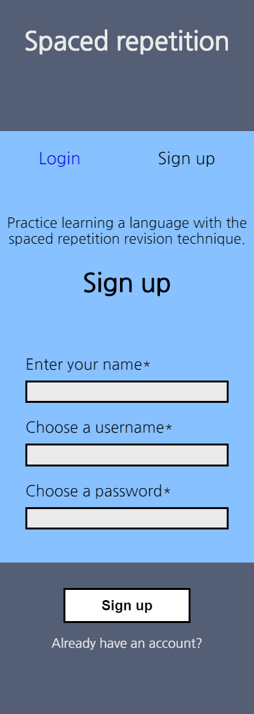
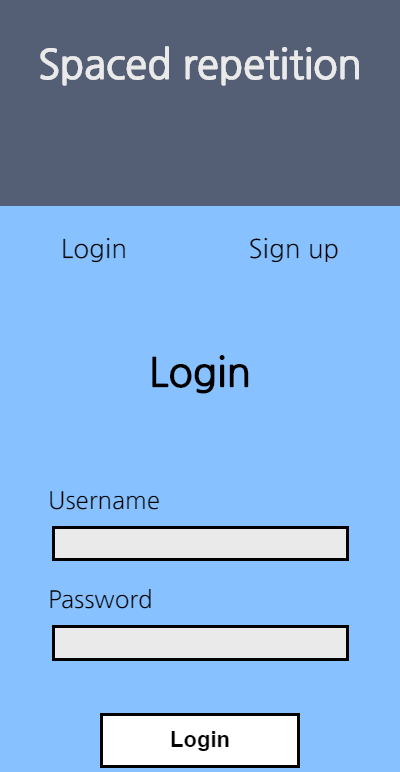
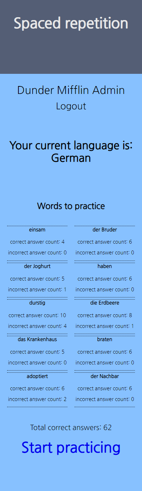
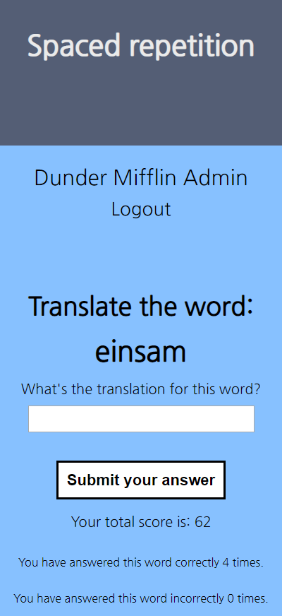
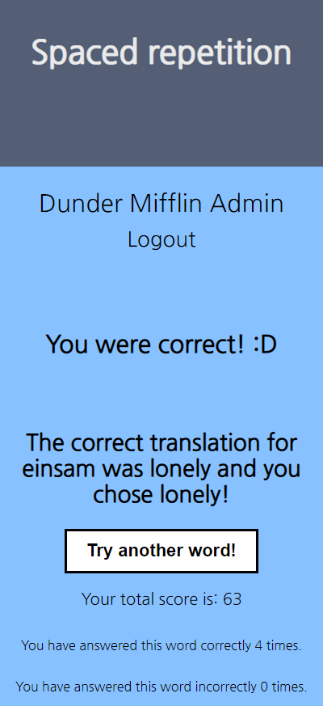
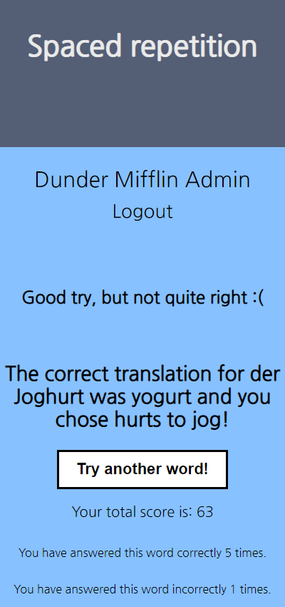

# Spaced Repetition Capstone
### from
## Alex Bannow and Sean Cooper

#### Description
  Imagine fancy, digital flash cards to help you learn a language that come with a built-in algorithm that's
  proven to help you learn faster! Stop imagining! Look at this app! It's real! 
  
  You can currently learn 10 
  very useful (probably) words in German.

  When you correctly translate a word, it moves
  further back in your list of words since you
  clearly know it well, you smarty. But, if for whatever reason you get a word wrong, that word
  will show up again very soon. Practice makes PERFEKT!

  In order to keep track of how well you're doing,
  a running total for each word documenting the number of times you guess correctly and incorrectly
  will be shown on the dashboard and the learning page, as well as an overall score of correct answers for the entire language.

##### Registration Page

##### Login Page

##### Dashboard Page

##### Learning Page

##### Correct Answer

##### Incorrect Answer

#### Relevant Links
Github repo: https://github.com/thinkful-ei-heron/spaced-repetition-client-alex-sean

Live App: https://spaced-repetition-client.rbannal.now.sh/login

Server Github repo: https://github.com/thinkful-ei-heron/spaced-repetition-api-alex-sean

Server URL: https://spaced-repetition-alex-sean.herokuapp.com/

#### Technology
HTML

CSS

Javascript

React

##### Viel Glück!